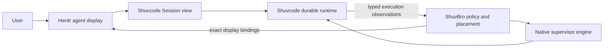

# Herdr, Shuvcode, and ShuvBro integration

Status: implemented for new managed native homes, with local three-repository evidence below. Companion review and two-host qualification remain open. PR #440 contains the Shuvcode runtime and attachment surfaces; its earlier isolated evaluation alone does not prove Herdr parity.

## Product contract

Herdr is the multiplexer and agent display. Shuvcode is the durable coding runtime. ShuvBro supplies orchestration policy and the lead/worker/secondmate workflow. A complete native path must make these three work together.

| Owner    | Responsibilities                                                                                                                              |
| -------- | --------------------------------------------------------------------------------------------------------------------------------------------- |
| ShuvBro  | Work and delivery policy, roles, home routing, presentation placement, and cleanup policy.                                                    |
| Shuvcode | Durable home/work/Session identities, prompt admission, execution, permissions, cancellation, recovery, and authenticated Session attachment. |
| Herdr    | Workspace/tab/pane topology, focus, terminal display, persisted attachment identity, and typed status presentation.                           |

The native supervisor is the sole durable workflow engine for a native home. ShuvBro's native adapter supplies policy and reconciles presentation; it must not run the legacy watcher/controller against the same home or create another authoritative workflow database.

## Baseline and repaired gaps

The source audit used Shuvcode `5eb9abbf104d7b6263a5fe6d7964465ae6dc286b`, ShuvBro `c013f429d079759d577fc91364aa1bf64337115f`, and Herdr `bfcc55318063bad80a527e84b575657399bb1753`. Herdr implementation starts from refreshed fork default `7874fa1c62ab1eb035cbe8c4d8031a95e9363326`, which adds startup diagnostics without changing the inspected attachment interfaces.

Herdr already has Shuvcode detection, a V2 TUI bridge driven by execution/permission/form events, metadata tokens, agent filters, workspace/tab/pane APIs, and SSH connections. Reuse those surfaces.

The implementation repairs these baseline gaps:

- Native supervisor attachment only covers the lead, assumes the initial project's directory, and drops Herdr client context while composing an isolated runtime environment.
- Herdr `agent start --kind shuvcode` selects the OpenCode family and currently launches the `opencode` executable.
- Herdr restores a Shuvcode Session from its ID without the managed home's location and service resolver. That can reconnect to the wrong runtime.
- Ordinary agent reports can return success after ignoring an update. A managed binding needs an applied/current response and readback.
- Headless native workers have no ShuvBro-owned Herdr presentation lifecycle. Task spaces, exact parent placement, persistent secondmates, and guarded cleanup need an adapter.

## Attachment and authority

A managed display binding contains a stable binding ID, native home UUID, exact Session ID, Session location, destination host identity, preserved executable/attach arguments, and the exact Herdr pane. The home resolver supplies current credentials at attachment time; snapshots and arguments contain no credentials.

Attachment only opens an existing Session view. It never initializes a home, activates a lead, admits a prompt, resumes execution, or discovers a different service. A managed restore uses this exact attachment instead of reconstructing a bare `shuvcode --session ID` command.

One publisher owns runtime status for each managed binding. The native projection reports typed execution observations. Ordinary TUI reporting continues for unbound sessions; navigation in a managed display cannot transfer the work's identity or authority.

Display state and execution state remain separate. A closed pane may accompany a running Session. A live pane may accompany an idle Session. Closing, detaching, or restoring presentation never means cancellation, completion, delivery, or worktree cleanup.

## Implementation

| Repository                 | Change                                                                                                                                                                                                                      |
| -------------------------- | --------------------------------------------------------------------------------------------------------------------------------------------------------------------------------------------------------------------------- |
| Shuvcode, existing PR #440 | Exact attach-only CLI, versioned read-only presentation data, native home/location validation, deliberate Herdr client environment composition, and selectable ShuvBro policy profile.                                      |
| Herdr fork                 | Preserve Shuvcode launch identity; add advertised binding, query, status-report, and unbind operations; persist reconnectable attachment data; acknowledge whether a report applied; preserve endpoint generation 1 codecs. |
| ShuvBro                    | Explicit native entrypoint/profile for new homes and an idempotent presentation adapter using native observations and Herdr bindings. Keep the journal as display provenance only.                                          |

ShuvBro retains exact-parent placement, creation without focus changes, disposable worker/scout spaces, and persistent lead/secondmate grouping. Labels and metadata tokens help presentation but never authorize mutation. Cleanup closes only the exact owned pane after runtime settlement and preserves neighboring panes and workspaces. Ambiguous outcomes retain the binding for reconciliation.

Remote secondmate homes own their own runtime and Herdr presentation. An unreachable destination remains unknown; the primary must not start a local replacement. SSH display disconnects must leave destination execution intact.

## Acceptance

1. Start a native ShuvBro lead and two real workers in an isolated Herdr instance. Verify exact Session IDs, worktree directories, parent placement, labels, and unchanged focus despite duplicate display names.
2. Exercise busy, permission/decision blocking, failure, completion, and disconnected observations. Reject stale or mismatched reports without changing a binding.
3. Reconcile repeatedly and simulate lost responses. Create no duplicate Sessions, prompt admissions, or display bindings.
4. Restart Herdr, the native server, and the supervisor independently. Reconnect to the same Sessions and preserved Shuvcode executable. A display close must leave a running Session running; native cancellation must settle without relying on pane liveness.
5. Restore and clean up exact bindings while preserving renamed spaces and neighboring panes. Verify remote destination ownership and refusal of local fallback.
6. Run against installed packages as well as source entrypoints. Keep stable endpoint compatibility fixtures unchanged. Measure affected rendering paths with one and at least fifteen populated panes if this implementation widens those paths.

Runtime proof uses private homes, configuration, sockets, and PTYs with inherited Herdr overrides removed. Existing operational homes and the default Herdr session are outside the evaluation. Fixtures prove only the behavior they exercise; two-host networking and production load require separate evidence.

## Local evidence, October 6, 2026, PDT

The joint lab used the compiled Linux Shuvcode CLI, the Herdr debug binary from the fork, and ShuvBro's public native entrypoint. A deterministic local Responses provider drove actual Sessions, shell tools, Git commits, decisions, and result receipts. The lab had private homes, sockets, and PTYs; production services were not involved.

| Check                  | Observed result                                                                                                                                                                                                         |
| ---------------------- | ----------------------------------------------------------------------------------------------------------------------------------------------------------------------------------------------------------------------- |
| Lead and workers       | One profiled ShuvBro lead and two workers received distinct native Sessions and worktree locations. Their Herdr views used the exact parent and left parent focus unchanged.                                            |
| Display closure        | Closing a running worker's pane left its native execution running. Reconciliation and Herdr restart did not recreate the closed view or issue another model call.                                                       |
| Settlement and cleanup | Native cancellation settled a worker despite its retained decision history. Cleanup closed only its bound pane; a neighboring pane, renamed workspace, and parent focus survived with no model calls.                   |
| Independent restart    | Native runtime/manager and Herdr restart preserved the home UUID, lead and worker Session IDs, closed bindings, and parent focus. Model request count stayed at 11 across this restart check.                           |
| Explicit reopen        | Reopening a closed display allocated a new binding generation and pane while retaining the original native Session.                                                                                                     |
| Verified completion    | A fresh worker answered a durable decision, committed `RESULT.md`, submitted hashed Git/artifact receipts, and completed. The actual Herdr-hosted Shuvcode TUI showed the successful result tool and response.          |
| Observation expiry     | A stopped publisher's binding became `unknown` with `fresh: false` after its five-second lease, while the settled native task remained intact. Run ShuvBro `watch` for continuing status; `up` and `sync` publish once. |

Shuvcode validation passed 174 supervisor tests with 1,232 assertions across 29 files, all 41 canonical `bun run check` tasks, and four compiled attachment/presentation tests with 50 assertions. Coverage includes exact-home/location rejection, no missing-Session fallback, no admission during attachment, permission blocking, descendant forms, adopted lead placement, and unavailable observations. The joint compiled run exposed a bundled Effect-schema boundary failure; plugin inputs now validate through portable Standard Schema wrappers, with an actual bundled-plugin regression test preserving provider JSON-schema constraints.

After merging fork default `a8a159aa544039ae9290f3de419d79c5683e1b68`, 54 focused Session/process-death recovery tests and all 41 canonical checks passed. The rebuilt CLI passed the four compiled tests again and recovered the existing joint home with all four Session identities and display bindings intact; the model request count remained 19. The merge retains prepared-subagent recovery after applying native supervisor cancellation to the affected recovery tree.

Herdr validation passed 3,823 Rust tests, formatting, Linux Clippy, maintenance, hotpath, assets, and six release render profiles. At 1/15 populated panes, server median rendering was 289/283 microseconds for background workspaces and 283/346 microseconds for active panes; client composition was 217/226 and 219/219 microseconds respectively. These are cardinality measurements, not a before/after performance comparison. Frozen generation-1 endpoint fixtures were unchanged. The full `just check` stopped at the existing missing Windows SDK libc configuration; Windows cross lint is unverified.

Joint snapshots, screenshots, and validation logs are retained locally under `/home/shuv/.cache/agent-ws/herdr-parity/`. ShuvBro's required no-mistakes review is tracked separately from this runtime evidence.

Initial rollout targets new managed native homes. Existing-home migration, two-host networking and SSH display disconnects, and production load remain unqualified. Destination homes own their own runtime and presentation; this change does not provision a remote host. The complete parity claim stays open until the outstanding three-repository review and qualification checks pass.
