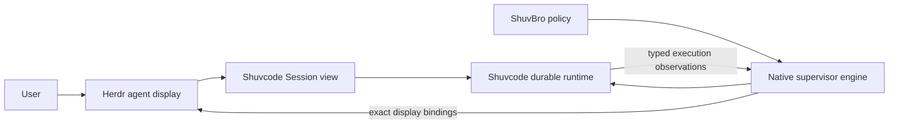

# Herdr, Shuvcode, and ShuvBro integration

Status: implemented and validated for new managed native homes in private local labs and on the exe.dev evaluation VM. Delivery spans [Shuvcode #440](https://github.com/shuv1337/shuvcode/pull/440), [Herdr #16](https://github.com/shuv1337/herdr/pull/16), and [ShuvBro #62](https://github.com/shuv1337/shuvbro/pull/62). Two-host qualification remains open; each evaluated home keeps its runtime and display on one host.

## Product contract

Herdr is the multiplexer and agent display. Shuvcode is the durable coding runtime. ShuvBro supplies orchestration policy and the lead/worker/secondmate workflow. A complete native path must make these three work together.

| Owner    | Responsibilities                                                                                                                            |
| -------- | ------------------------------------------------------------------------------------------------------------------------------------------- |
| ShuvBro  | Work and delivery policy, roles, home routing, and optional adapter placement and cleanup policy.                                           |
| Shuvcode | Durable home/work/Session identities, execution, permissions, recovery, authenticated attachment, and the bare launcher's background views. |
| Herdr    | Workspace/tab/pane topology, focus, terminal display, persisted attachment identity, and typed status presentation.                         |



The native supervisor is the sole durable workflow engine for a native home. The bare `shuvcode supervisor` launcher now owns ordinary firstmate/worker presentation through its background process. ShuvBro's explicit native adapter remains available for homes with its placement policy; a home containing its `native-display.json` keeps that publisher. These publishers never run together for one home, and neither uses pane liveness as execution authority.

## Bare launcher

`shuvcode supervisor` works from any directory and uses `~/fleet-home` by default. It creates a projectless fleet, reuses the durable firstmate Session, and accepts conversational project registration through `supervisor_project`. Inside Herdr it focuses a managed firstmate pane; outside it opens an ordinary attached TUI. The supervisor publishes worker views independently of that TUI's lifetime.

Discovery uses the current Herdr pane's explicit socket/session first. Outside Herdr it chooses a running default session or the sole running named session, then persists that peer identity. Multiple ambiguous named sessions require launching inside the intended session. A headless Herdr server works; Herdr may also start after native work has begun. Each view gets its own workspace at the exact native Session location, without requiring a retained parent shell. Worker creation does not steal focus.

The daemon alone writes `herdr-views.json`. It journals creation, binding, launch, and report sequence before mutation. A lost create result remains unresolved; a lost PTY acknowledgement is not resent. Readback requires the exact pane, binding, attachment, and foreground argv. Closed views stay closed during ordinary reconciliation; explicitly launching the fleet again creates a new view generation for the same Session, retaining prior identities. `herdr-status.json` reports display availability separately from workflow health. Missing, stopped, incompatible, and mismatched Herdr peers never prevent native work.

## Baseline and repaired gaps

The source audit used Shuvcode `5eb9abbf104d7b6263a5fe6d7964465ae6dc286b`, ShuvBro `c013f429d079759d577fc91364aa1bf64337115f`, and Herdr `bfcc55318063bad80a527e84b575657399bb1753`. Herdr implementation starts from refreshed fork default `7874fa1c62ab1eb035cbe8c4d8031a95e9363326`, which adds startup diagnostics without changing the inspected attachment interfaces.

Herdr already has Shuvcode detection, a V2 TUI bridge driven by execution/permission/form events, metadata tokens, agent filters, workspace/tab/pane APIs, and SSH connections. Reuse those surfaces.

The implementation repairs these baseline gaps:

- Native supervisor attachment only covers the lead, assumes the initial project's directory, and drops Herdr client context while composing an isolated runtime environment.
- Herdr `agent start --kind shuvcode` selects the OpenCode family and currently launches the `opencode` executable.
- Herdr restores a Shuvcode Session from its ID without the managed home's location and service resolver. That can reconnect to the wrong runtime.
- Ordinary agent reports can return success after ignoring an update. A managed binding needs an applied/current response and readback.
- Headless native workers have no ShuvBro-owned Herdr presentation lifecycle. Task spaces, exact parent placement, persistent secondmates, and guarded cleanup need an adapter.

## Attachment and authority

A managed display binding contains a stable binding ID, native home UUID, exact Session ID, Session location, destination host identity, preserved executable/attach arguments, and the exact Herdr pane. The home resolver supplies current credentials at attachment time; snapshots and arguments contain no credentials.

Attachment only opens an existing Session view. It never initializes a home, activates a lead, admits a prompt, resumes execution, or discovers a different service. A managed restore uses this exact attachment instead of reconstructing a bare `shuvcode --session ID` command.

One publisher owns runtime status for each managed binding. The native projection reports typed execution observations. Ordinary TUI reporting continues for unbound sessions; navigation in a managed display cannot transfer the work's identity or authority.

Display state and execution state remain separate. A closed pane may accompany a running Session. A live pane may accompany an idle Session. Closing, detaching, or restoring presentation never means cancellation, completion, delivery, or worktree cleanup.

## Implementation

| Repository                 | Change                                                                                                                                                                                                                      |
| -------------------------- | --------------------------------------------------------------------------------------------------------------------------------------------------------------------------------------------------------------------------- |
| Shuvcode, existing PR #440 | Bare firstmate launcher, projectless fleet homes, background Herdr views, exact attach-only CLI, versioned presentation data, home/location validation, and selectable ShuvBro policy profile.                              |
| Herdr fork                 | Preserve Shuvcode launch identity; add advertised binding, query, status-report, and unbind operations; persist reconnectable attachment data; acknowledge whether a report applied; preserve endpoint generation 1 codecs. |
| ShuvBro                    | Explicit native entrypoint/profile for new homes and an idempotent presentation adapter using native observations and Herdr bindings. Keep the journal as display provenance only.                                          |

The explicit ShuvBro adapter retains exact-parent placement, creation without focus changes, disposable worker/scout spaces, and persistent lead/secondmate grouping. Labels and metadata tokens help presentation but never authorize mutation. Its cleanup closes only the exact owned pane after runtime settlement and preserves neighboring panes and workspaces. Ambiguous outcomes retain the binding for reconciliation.

The ShuvBro adapter verifies the actual Herdr peer's named session through JSON ping before native execution or display mutation. The bare launcher starts native work independently and negotiates Herdr before display mutation. An attach becomes ready only after exact foreground argv is observed; a close completes only after pane absence is confirmed. Persisted closed binding owners reserve their public workspace identities across Herdr restart, so recorded topology remains meaningful after views disappear.

Remote secondmate homes own their own runtime and Herdr presentation. An unreachable destination remains unknown; the primary must not start a local replacement. SSH display disconnects must leave destination execution intact.

## Acceptance

1. Start a native ShuvBro lead and two real workers in an isolated Herdr instance. Verify exact Session IDs, worktree directories, parent placement, labels, and unchanged focus despite duplicate display names.
2. Exercise busy, permission/decision blocking, failure, completion, and disconnected observations. Reject stale or mismatched reports without changing a binding.
3. Reconcile repeatedly and simulate lost responses. Create no duplicate Sessions, prompt admissions, or display bindings.
4. Restart Herdr, the native server, and the supervisor independently. Reconnect to the same Sessions and preserved Shuvcode executable. A display close must leave a running Session running; native cancellation must settle without relying on pane liveness.
5. Restore and clean up exact bindings while preserving renamed spaces and neighboring panes. Verify remote destination ownership and refusal of local fallback.
6. Run against installed packages as well as source entrypoints. Keep stable endpoint compatibility fixtures unchanged. Measure affected rendering paths with one and at least fifteen populated panes if this implementation widens those paths.

Runtime proof uses private homes, configuration, sockets, and PTYs with inherited Herdr overrides removed. Existing operational homes and the default Herdr session are outside the evaluation. Fixtures prove only the behavior they exercise; two-host networking and production load require separate evidence.

## Local evidence, October 6, 2026, PDT

The joint lab used the compiled Linux Shuvcode CLI, the Herdr debug binary from the fork, and ShuvBro's public native entrypoint. A deterministic local Responses provider drove actual Sessions, shell tools, Git commits, decisions, and result receipts. The lab had private homes, sockets, and PTYs; production services were not involved.

| Check                  | Observed result                                                                                                                                                                                                         |
| ---------------------- | ----------------------------------------------------------------------------------------------------------------------------------------------------------------------------------------------------------------------- |
| Lead and workers       | One profiled ShuvBro lead and two workers received distinct native Sessions and worktree locations. Their Herdr views used the exact parent and left parent focus unchanged.                                            |
| Display closure        | Closing a running worker's pane left its native execution running. Reconciliation and Herdr restart did not recreate the closed view or issue another model call.                                                       |
| Settlement and cleanup | Native cancellation settled a worker despite its retained decision history. Cleanup closed only its bound pane; a neighboring pane, renamed workspace, and parent focus survived with no model calls.                   |
| Independent restart    | Native runtime/manager and Herdr restart preserved the home UUID, lead and worker Session IDs, closed bindings, and parent focus. Model request count stayed at 11 across this restart check.                           |
| Explicit reopen        | Reopening a closed display allocated a new binding generation and pane while retaining the original native Session.                                                                                                     |
| Verified completion    | A fresh worker answered a durable decision, committed `RESULT.md`, submitted hashed Git/artifact receipts, and completed. The actual Herdr-hosted Shuvcode TUI showed the successful result tool and response.          |
| Continuous watch       | Cleanup and reopen succeeded while `watch` stayed active, preserving exact Session identity, neighboring panes, parent focus and native settlement. Model request count stayed at 4.                                    |
| Observation expiry     | A stopped publisher's binding became `unknown` with `fresh: false` after its five-second lease, while the settled native task remained intact. Run ShuvBro `watch` for continuing status; `up` and `sync` publish once. |
| Client completion      | The real Herdr client retained the worker's Done state before acknowledgement, after viewing it, and after Herdr restart. Home, Session, pane and binding identities survived; model requests stayed at 4.              |
| Peer identity          | Missing and mismatched peer session names were refused. A mismatched named socket left the proposed native home uninitialized, existing display topology unchanged, and model requests unchanged.                       |
| Closed identity        | The highest bound pane `w5:p1` and its workspace were closed. After Herdr restart with only `w1` through `w4` surviving, the next create returned `w6:p1`; focus and model request count were preserved.                |

Shuvcode validation passed 175 supervisor tests with 1,237 assertions across 29 files, all 41 canonical `bun run check` tasks, and four compiled attachment/presentation tests with 50 assertions. Coverage includes exact-home/location rejection, no missing-Session fallback, no admission during attachment, permission blocking, descendant forms, adopted lead placement, and unavailable observations. The joint compiled run exposed a bundled Effect-schema boundary failure; plugin inputs now validate through portable Standard Schema wrappers, with an actual bundled-plugin regression test preserving provider JSON-schema constraints. A concurrent status refresh also exposed an observation-cursor race. Delivery refresh now preserves the reconciliation cursor, with a deterministic overlap regression that fails before the fix and passes after it.

After merging fork default `a8a159aa544039ae9290f3de419d79c5683e1b68`, 54 focused Session/process-death recovery tests and all 41 canonical checks passed. The rebuilt CLI passed the four compiled tests again and recovered the existing joint home with all four Session identities and display bindings intact; the model request count remained 19. The merge retains prepared-subagent recovery after applying native supervisor cancellation to the affected recovery tree.

Herdr validation at `63835aa2d261560be02b9b50968f79d6119925be` passed 3,830 Rust tests, formatting, Linux Clippy, maintenance, hotpath, assets, and JSON schema checks. Six release render profiles on the completed presentation path passed: at 1/15 populated panes, server median rendering was 293/289 microseconds for background workspaces and 293/360 microseconds for active panes; client composition was 214/226 and 222/217 microseconds respectively. The subsequent ping identity field adds no rendering work. These are cardinality measurements, not a before/after performance comparison. Frozen generation-1 endpoint fixtures were unchanged. The full local `just check` stopped at the existing missing Windows SDK libc configuration; local Windows cross lint is unverified. All seven native GitHub checks at this revision passed, including Ubuntu, macOS, Windows, and ConPTY.

Late Herdr review repaired Done state in actual client snapshots, ownership after moving an unbound tombstone, scrollback and error retention when restore fails, and executable-name normalization. Two production-client regressions failed before the Done fix and passed after it; the actual shell proof above additionally checked acknowledgement and restart. The final peer-capable private binary had SHA-256 `aa98c90952d6b10ce14e9c030d2846d8fa24f6ddb57bcaa0187041d6be22b8f2`.

Joint snapshots, screenshots, and validation logs are retained locally under `/home/shuv/.cache/agent-ws/herdr-parity/`. ShuvBro's required no-mistakes pipeline additionally validates its public entrypoint with a hermetic native CLI and Herdr socket. Its review repaired per-entry failure isolation, absent-entry closure, title validation before pending creation, watch lock handoff and stale-owner reclaim, and test teardown. The continuous-watch proof used ShuvBro `089d2b789a4e41aaa607a066ee06b8f72e3c5c8f` with adapter SHA-256 `e63cfe03b39a15f6382e146df952b50ee6c3a42306a0d72682161a2b3d3e0c05`. Herdr's initial Windows CI exposed Unix-only fixture paths; the tests now use platform-native absolute paths while production path validation remains strict.

The follow-up adapter at `76d68406aabf9d7b7d5774bd6129fbafc89582ab`, SHA-256 `cbf89f86a44088aa70e246b8907e327933ea43725368c327f054a875f3e604fa`, passed the peer-identity and continuous-watch checks against the final Herdr binary. Exact foreground argv and both closed pane absences were observed; both generations' neighboring panes, parent focus, native settlement, and the 4-model-request count were preserved.

The subsequent candidate at `ca4dc6174aae25820f2fcc8bd1f2425b2e971757`, adapter SHA-256 `961fb5bb59c638fdd09b16a56dfd2568df5e1316a3ae47e2f05f0ecd45ab8e0a`, fixes first-pass handling of an acknowledged attach whose foreground process is not visible yet. A fresh private lab observed `up` exit successfully in `launch_pending` with sequence zero, followed by `ready` only after exactly one matching foreground attach process appeared. Its real worker completed, and concurrent watch/cleanup/reopen retained the Session, neighboring panes, parent focus, and native settlement with model requests unchanged at 4. All 20 executable CLI tests passed, including the delayed-launch regression. These tests use simulated fault peers; the private PTY workflow supplies separate real-runtime evidence. The candidate remains in the required pipeline Test evidence-review gate and is not yet the published ShuvBro PR head.

## exe.dev testing, October 6, 2026, PDT

Open the current firstmate lead directly, from any directory:

```sh
ssh -t shuvcode-test.exe.xyz shuvcode supervisor
```

The home is `/home/exedev/fleet-home`. It uses `eval/gpt-6-sol` through exe.dev's configured provider, with automatic tool permissions and manual merge authority. After the operator-requested reset, it retains the `2password` checkout and registration, with a fresh firstmate and no tasks or conversation. The supervisor and Herdr are stopped at handoff. The earlier trial described below is historical evidence; its Sessions and test worktrees have been removed.

Before the reset, firstmate conversationally registered `/home/exedev/eval/fleet-launcher-project` as `launcher`, then completed the `bare-smoke` scout with a verified report. An independent rerun passed all three Bun tests. This completed while Herdr was absent.

For all worker views:

```sh
ssh -t shuvcode-test.exe.xyz herdr
```

The default Herdr server added firstmate and the scout without any client attached. Running `shuvcode supervisor` in a Herdr shell focuses firstmate; workers get separate workspaces without a parent-shell dependency. Detach with Ctrl+B, then Q. Native execution and the background publisher continue. The default Herdr server runs in `herdr-fleet-launcher.service`; no ShuvBro watch process is needed for this home. The service is not enabled at boot; `herdr` starts its ordinary interactive session, or `sudo systemctl start herdr-fleet-launcher` starts a headless server.

The source suite passed 181 supervisor tests with 1,284 assertions, the compiled Linux CLI passed five project/attachment/presentation tests with 57 assertions, and all 41 canonical check tasks passed. Fault tests cover incompatible peer identity/capabilities, uncertain creation across supervisor restart, lost launch acknowledgement, explicit closed-view reopening, and refusal to focus a replaced lead's old pane. A compiled private PTY run closed the outside TUI and attached/detached Herdr twice while the worker remained running; releasing its model response produced a verified result. All private local fixtures were stopped afterward.

On the VM, the supervisor and Herdr were restarted independently. Launches from `/tmp` and `/usr` retained the home, lead and worker Session IDs, pane IDs, and bindings. Native step started/streamed/ended counts remained 16 before and after. A second real scout, `reconnect-smoke`, remained running after closing the outside SSH TUI and after two Herdr client attach/detach cycles over SSH; its Session ID and the lead's Session ID stayed unchanged. Copies of the launcher proof files remain locally under `/home/shuv/.cache/agent-ws/herdr-parity/vm-launcher/`.

The startup-knowledge follow-up reproduced duplicate context on the second user message, moved knowledge and budget warnings into model system context, and verified unchanged user history across subsequent messages, restart, and curation. All 181 supervisor tests passed with 1,298 assertions; the compiled regression passed 28 assertions and all 41 canonical checks passed. The reset removed 21 old Sessions across five homes, retired the four earlier homes and wrappers, and cleared Herdr's saved test views. The real project checkout was preserved.

### Earlier ShuvBro adapter trial

The earlier explicit adapter trial used Herdr's named `native-herdr` session and the native home `/home/exedev/eval/native-herdr`. It used `eval/gpt-6-sol`, automatic tool permissions, and local-only delivery with manual operator approval for landing. Its Sessions, worktrees, wrapper commands, and watcher were retired during the requested reset.

The Ubuntu 24.04 trial ran the compiled Shuvcode CLI, Herdr `63835aa2d261560be02b9b50968f79d6119925be`, and the ShuvBro candidate above. A real model-driven worker committed a greeting implementation, tests, and `RESULT.md`; an independent rerun passed all three tests, its native receipt verified, and the operator landed commit `99218396c723202aff6607958c64cefcda34b91e` locally. Restarting Herdr preserved the home, Session, pane, and binding identities, with the lead idle and worker Done.

The plain `shuvcode` command selects `~/fleet-home`. It supplies its own background presentation publisher and does not need the retired ShuvBro watch service. The separate ShuvBro publication gate remains pending.

Initial rollout targets new managed native homes. Existing-home migration, two-host fleet networking, and production load remain unqualified. The VM test qualifies SSH display disconnect/reconnect while destination-native work continues. Destination homes own their own runtime and presentation; this change does not provision a remote host.
